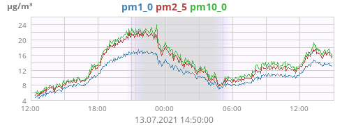

# weewx-airQ
Service for WeeWX to retrieve air quality data from the airQ device of Corant GmbH

PM<sub>1.0</sub>, PM<sub>2.5</sub>, PM<sub>10.0</sub>, TVOC, 
CO, CO<sub>2</sub>, O<sub>2</sub>, O<sub>3</sub>, NO<sub>2</sub>, 
H<sub>2</sub>S, SO<sub>2</sub>, noise, health index, performance index,
temperature, humidity, dewpoint, air pressure

## Prerequisites

The following Python modules are necessary to use this extension:
* base64
* Cryptodome.Cipher
* http.client
* json
* threading

It depends on the distribution you use whether those modules are installed
by default. For Debian this installation should do it:
```
sudo apt-get install python3-cryptodome
```

User Hartmut was successful with that:
```
sudo apt-get install build-essential python3-dev 
pip3 install pycryptodomex 
python3 -m Cryptodome.SelfTest 
```


## Installation instructions:

1) download

   wget -O weewx-airQ.zip https://github.com/roe-dl/weewx-airQ/archive/master.zip

2) run the installer

   sudo wee_extension --install weewx-airQ.zip

3) edit configuration in weewx.conf

   ```
   [airQ]

       query_interval = 5.0 # this is the default, if option is missing

       [[first_device]]
           host = replace_me_by_host_address_or_IP
           password = replace_me
           #prefix = replace_me # optional
           #altitude = value, unit # optional, default station altitude
           #query_interval = value # optional, if different from general setting

       [[second_device]]
           ...
   ...
   [Engine]
       [[Services]]
           ...
           data_services = ... ,user.airQ_corant.AirqService
   ```
   
5) restart weewx

   ```
   sudo /etc/init.d/weewx stop
   sudo /etc/init.d/weewx start
   ```

## Usage:

Using this extension you get the readings out of the airQ measuring
device and can

* save them to the database
* display them using tags in skins
* display them in graphs

### Prefix

Most of the the observation types provided by the airQ device are
predefined within WeeWX. If no special configuration besides host
address and password is provided the readings are stored to
those observation types. 

If you have more than one airQ device, you need different names of the 
observation types for each of them. That's the prefix for. 
Imagine there are 3 airQ devices, one outside, one in the bedroom and 
one in the living room. Your could configure the outside device without 
prefix to put `co`, `co2`, `no2`, `noise`, `o3`, `pm1_0`, `pm2_5`, 
`pm10_0`, and `so2` into the predefined columns of the WeeWX database. 
For the bedroom device you could set `prefix = bedroom`. So you get 
`bedroom_co`, `bedroom_co2` etc. for that device. And for the living 
room device you could set `prefix = livingroom`. So you get 
`livingroom_co`, `livingroom_co2`, etc. for that. 

### Adding additional columns to the database

This extension comes with a special configuration tool called `airq_conf`.
The tool is based on the WeeWX `wee_database` tool and provides means
to add the necessary columns according to the prefix setting to the
database or drop them from it. See below for details.

### Display values (CheetahGenerator)

The observation types described below can be used for tags as described
in the [WeeWX Customization
guide](http://weewx.com/docs/customizing.htm#Tags).

Example: `$current.TVOC`

### Diagrams (ImageGenerator)

To create diagrams you need to include additional sections into the 
[ImageGenerator] section of skin.conf. This is an example:

```
        [[[dayPM]]]
            [[[[pm1_0]]]]
            [[[[pm2_5]]]]
            [[[[pm10_0]]]]
```

The result is as follows:




## Observation types:

Dependent on hardware configuration the following observation types
are provided. The names are given as if no prefix is specified:

* **airqDeviceID**: (provided if included in `[StdWXCalculate]` only) 
  device ID of the device
* **airqStatus**: (provided if included in `[StdWXCalculate]` only)
  sensor error messages or "OK" if none
* **airqBattery**: battery status (actually not used)
* **co**: CO concentration
* **co2**: CO<sub>2</sub> concentration
* **dCO2dt**: CO<sub>2</sub> changing rate
* **dHdt**: absolute humidity changing rate
* **airqDewpoint**: dewpoint
* **airqDoorEvent**: (experimental) door opened or closed
* **h2s**: H<sub>2</sub>S concentration
* **airqHealthIdx**: health index (special index according to a newly
  developed algorithm from the manufacturer)
* **airqHumidity**: relative humidity
* **airqHumAbs**: absolute humidity
* **airqMeasuretime**: duration of the last measuring cycle
* **no2**: NO<sub>2</sub> concentration
* **o3**: O<sub>3</sub> concentration
* **o2**: O<sub>2</sub> concentration
* **airqPerfIdx**: performance index (special index according to a newly
  developed algorithm from the manufacturer)
* **pm1_0**, **pm2_5**, **pm10_0**: particulate matter 
* **cnt0_3**, **cnt0_5**, **cnt1_0**, **cnt2_5**, **cnt5_0**, **cnt10_0**: 
  amount of particles
  of the appropriate size
* **TypPS**: typical particle size
* **airqPressure**: air pressure
* **airqAltimeter** altimeter value (air pressure corrected by altitude, 
  software calculated, not received from the device)
* **so2**: SO<sub>2</sub> concentration
* **airqNoise**: sound level
* **airqTemp**: temperature
* **TVOC**: volatile organic compounds concentration (including Corona
  viruses)
* **airqUptime**: uptime of the device

If a prefix is provided "airq" is replaced by the prefix. If the
name does not start by "airq" the prefix is prepended to the name.

## Configuration tool `airq_conf`

### General options

* `--device=DEVICE`: airQ device to set/get configuration for
* `--config=CONFIG_FILE`: use configuration file CONFIG_FILE. Default
  according to the way of WeeWX installation
* `--binding=BINDING_NAME`: Use binding BINDING_NAME. Default is `wx_binding`.

### General commands

* `airq_conf --help`:
  display usage instructions
* `airq_conf --device=DEVICE --print-config`:
  read the device configuration and display

### Add or drop columns to/from the database

The `wee_database` utility allows adding columns to the database one by one
only. As the airQ device provides a lot of additional observation types,
this is quite uncomfortable. The `airq_conf` tool provides the possibility
to add all the additional columns in one step. It regards the `prefix`
configuration option. By using the original WeeWX
functions for that, it should be safe. Nevertheless, backups are alsways a
good idea. And stop WeeWX for that.

**CAUTION:** Stop WeeWX and make a backup of the database before using these
commands.

* `airq_conf --device=DEVICE --add-columns`:
  add the necessary columns to the database
* `airq_conf --device=DEVICE --drop-columns`:
  drop the columns from the database

### Set configuration parameters in the airQ device

Those commands change configuration settings within the airQ device.

* `airq_conf --device=DEVICE --set-location=station`:
  set the location of the airQ device to the station location
* `airq_conf --device=DEVICE --set-location=LATITUDE,LOGITUDE`:
  set the location of the airQ device to latitude and longitude provided
* `airq_conf --device=DEVICE --set-roomsize=HEIGHT,AREA`:
  set the room size data
* `airq_conf [--device=DEVICE] --set-ntp=NTP_SERVER`:
  set the NTP server
* `airq_conf [--device=DEVICE] --set-ntp=de`:
  set the NTP server to the official german server of PTB.

## Links:

* [Web site of the airQ device](https://www.air-q.com) 
* [airQ data sheet (german)](https://uploads-ssl.webflow.com/5bd9feee2fb42232fe1d0196/5f898b110a9e9fea8049fa29_air-Q_Specs_de_aktuell_2020-06-25.pdf)
* [WeeWX homepage](http://weewx.com) - [WeeWX Wiki](https://github.com/weewx/weewx/wiki)
* [Wöllsdorf weather conditions](https://www.woellsdorf-wetter.de)
